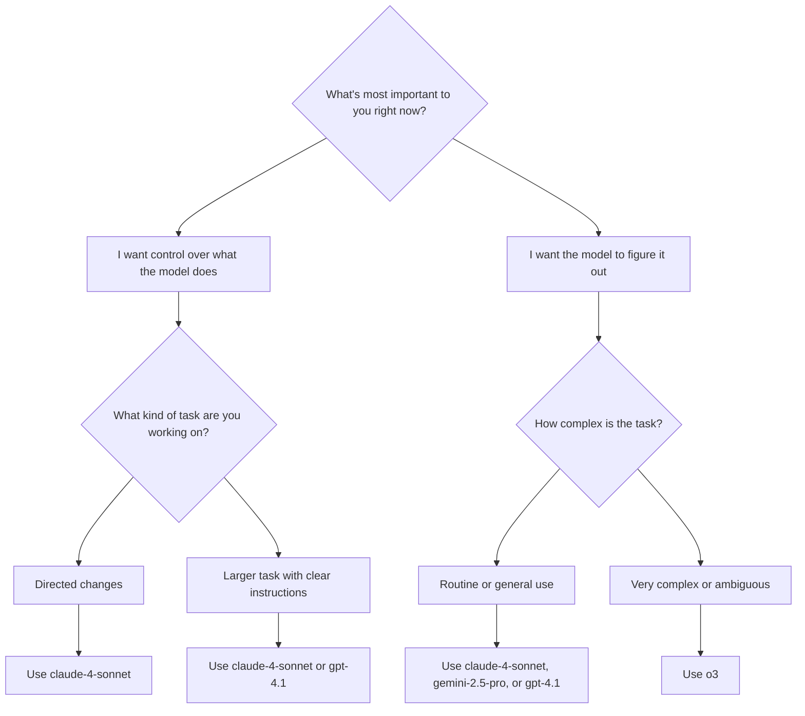

# Guide to Effective AI Coding Collaboration

---

🧠 Executive Summary
AI coding assistance represents a conversation orchestration skill in indeterministic environments, not a deterministic productivity multiplier. Success requires structured iteration protocols, disciplined task decomposition, and systematic quality gates.
**Core Reality:** AI gets you 70% of the way quickly, but the remaining 30% requires human architectural thinking and domain expertise.

---

## 📊 Understanding AI Coding Effectiveness

### Core Performance Patterns

AI coding tools show **predictable effectiveness patterns** based on specific factors:

**✅ High Success Scenarios:**
- Systematic debugging and performance tuning
- Code migration and configuration optimization  
- Well-defined, decomposable processes
- Immediate feedback loops with measurable outcomes
- Popular languages (Python, Java) with simple tasks

**⚠️ Medium Success Scenarios:**
- Feature development in familiar domains
- Brownfield projects with simple modifications
- Popular languages with complex requirements

**❌ Low Success Scenarios:**
- Architecture design and novel algorithm development
- Creative problem-solving in unexplored domains
- Large codebases (>100K LOC) with complex interdependencies
- Unpopular languages (COBOL, Haskell) with complex tasks

### The Performance Reality Matrix

| Context | AI Productivity Impact | Key Characteristics |
|---------|----------------------|-------------------|
| **Greenfield + Simple Tasks** | +30-35% | New projects, well-defined requirements |
| **Greenfield + Complex Tasks** | +10-15% | New projects, requires deep human insight |
| **Brownfield + Simple Tasks** | +15-20% | Legacy projects, straightforward modifications |
| **Brownfield + Complex Tasks** | +0-10% | Legacy constraints, intricate dependencies |

### Context Length Impact on Performance

| Context Size | Expected Performance Drop |
|--------------|---------------------------|
| 1K tokens | Baseline (near-optimal) |
| 8K tokens | 12-30% degradation |
| 16K tokens | 22-45% degradation |
| 32K tokens | 32-72% degradation |

**Key Insight**: Performance degrades significantly as context grows. Keep sessions focused and bounded.

---

## 🎯 The 15-Minute Rule: Foundation Principle

> **If a task takes more than 15 minutes, it's too big.**

### Task Sizing Success Rates

| Task Size | Duration | AI Success Rate | Example |
|-----------|----------|-----------------|---------|
| **Micro** | 5 min | 95% | Add loading spinner, fix typo |
| **Small** | 15 min | 85% | Create component, add validation |
| **Medium** | 45 min | 60% | Implement search feature |
| **Large** | 2+ hours | 20% | Build entire dashboard |

### Proper Task Decomposition

**❌ Wrong Approach:**
```
"Build user authentication system"
```

**✅ Right Approach:**
```
 - Create login form component  
 - Add email validation  
 - Set up password hashing  
 - Create JWT token endpoint  
 - Add login button to navbar  
 - Write login success test
```

---

## 🏗️ Workflow Pattern

### 1. The "AI first draft" pattern
- Let AI generate a basic implementation
- Manually review and refactor for modularity
- Add comprehensive error handling
- Write thorough tests
- Document key decisions

### 2. The "Constant conversation" pattern
- Start new AI chats for each distinct task
- Keep context focused and minimal
- Review and commit changes frequently
- Maintain tight feedback loops

### 3. The "Trust but verify" pattern
- Use AI for initial code generation
- Manual review of all critical paths
- Automated testing of edge cases
- Regular security audits

---

## 🎛️ AI Model Selection

**🎯 Choosing the right AI model for different tasks**



**🎨 Prompting style**
- 🎛️ Be in control, give clear instructions: `claude-4-sonnet`, `gpt-4.1`
- 🚀 Let the model take initiative: `claude-4-opus`, `gemini-2.5-pro`, `o3`

**🎯 Task type**
- 🎯 Directed changes: `claude-4-sonnet`, `gemini-2.5-pro`
- 🔍 Codebase navigation/search: `gemini-2.5-pro`, `claude-4-opus`, `o3`
- 📋 Planning or problem-solving: `claude-4-opus`, `gemini-2.5-pro`
- 🧠 Complex bugs or deep reasoning: `o3`

---

## 🏗️ Tips

### 🏗️ Setup & Configuration

#### 1. 📋 Start Like a Project Manager, Not a Prompt Monkey
- ✍️ Write a real PRD before anything else
- 📝 Describe what you're building, why, and what tools you're using
- 📁 Keep it in your root directory as `product.md` or `instructions.md`
- 🔄 Reference this often — AI context evaporates quickly

#### 2. 🧹 Clean Your House Weekly
- 🗑️ Delete temp files and dead code
- 📁 Reorganize folders
- ✨ Clean codebases make better prompts

#### 3. 📐 Evolve .cursorrules Through Experience
- 🌱 **Start small** — don't overthink the initial rules file
- 🔄 **When Cursor gets it right after your intervention**: Ask it to author/update a rule with its learnings
- ❌ **Two-mistake rule**: Add to `.cursorrules` whenever Cursor repeats the same mistake twice
- 🎯 **Optional boost**: Reference [cursor.directory/rules](https://cursor.directory/rules) for framework-specific templates
- 🎓 **Result**: Organic evolution from toddler to disciplined intern based on your actual workflow

### 🧠 Workflow Architecture

#### 4. 🗺️ Don't Touch Anything Until You've Scoped the Feature
- 🎯 Use GPT/Claude to map the full feature first
- 🔍 Choose a single approach before coding
- ⚡ Cursor is for execution, not ideation

#### 5. 🧩 Prompt in Layers for Maximum Clarity
- 📋 Use GPT to plan architecture
- 🔍 Use Claude to critique approach
- ⚡ Use Cursor to execute code
- 💡 Use parallel sessions for better thinking

#### 6. 🐛 Master the Debug Strategy
- ❓ **First**: Ask AI to investigate — "What broke? Why?" (demand reasoning)
- 📋 **Before fixing**: Request 3 potential solutions, choose one approach
- 🔧 **Then**: Execute the fix systematically  
- 📝 **Finally**: Document the solution in your rules

#### 7. 🔗 Reference Existing Code Patterns
- ❌ **Don't**: "Make a dropdown menu"
- ✅ **Do**: "Make a dropdown similar to @components/Select.tsx"
- 🎯 AI performs significantly better with concrete code context
- 🔍 Cursor can see and learn from your existing patterns

### ⚡ Execution Discipline

#### 8. 🧩 Practice Task Sizing Discipline
- ✂️ Split work into 1-3 message blocks (micro prompts)
- ⏰ **15-Minute Rule**: If task takes >15 minutes, it's too big
- 🚫 Don't ask Cursor to build entire applications
- 🎯 Use AI for stubs, logic chunks, controlled refactors
- 📈 Remember: Task size correlates directly with AI failure rate

#### 9. 💬 Short Chats > Smart Chats
- 🚫 Don't hoard 400-message threads
- 🆕 Start new chat per issue
- 🎯 Keep scope tight with clear commands

#### 10. ⚡ Tech Debt Builds at AI Speed
- 🚀 AI helps you MVP fast, but also digs mess faster
- ⏸️ Pause regularly to refactor and maintain architecture
- 📋 Use git checkpoints every hour for safety
- 🏗️ Keep structural integrity as your priority

---

## 🚨 Critical Limitations & Reality Checks

### The 70% Paradox
**Problem**: AI can get you 70% of the way there, but the last 30% becomes frustrating with backwards progress, new bugs, and circular issues.

**Solution**: Build your workflow around this reality - plan for the final 30% refinement phase.

### The Net Productivity Reality

| Activity | Impact | Notes |
|----------|--------|--------|
| **New Code Generation** | +30-40% | AI excels at initial code creation |
| **Rework Required** | -15-25% | Significant debugging and cleanup needed |
| **Net Productivity** | **+15-20%** | Actual overall improvement |

### Developer Behavior Patterns

**Time Allocation Changes:**
- **4%** waiting on AI generations
- **9%** reviewing/cleaning AI outputs  
- **<44%** of AI generations accepted as-is
- **Majority** report making major changes to AI code

**Psychological Effects:**
- Developers *feel* 20% more productive
- Actual measured productivity *decreases* 19%
- Less cognitive effort perception creates positive bias
- Starting from AI output feels easier than blank page

---

## 🎯 Strategic Decision Framework

**Greenlight Scenarios:**
- Popular programming languages
- Well-defined requirements
- Small, focused tasks (< 15 minutes)
- Patterns that exist in training data
- Immediate feedback available

**Caution Scenarios:**
- Large codebases (> 100K LOC)
- Novel/niche requirements  
- Complex architectural decisions
- Security-critical implementations
- Performance-sensitive code

**Red Flag Scenarios:**
- Unpopular/specialized languages
- Creative algorithm development
- Mission-critical system design
- Compliance-heavy domains
- Real-time system constraints

---

## 💡 Mastery Fundamentals

### Autocomplete Optimization
- **Most underrated feature** - configure and rely on intelligent autocomplete
- Often more effective than full code generation
- Reduces cognitive load while maintaining control

### Context Mangagement
- **Prompt is only a small part** of AI input
- **Context provision and settings** often matter more
- **Multiple interaction rounds** usually required
- **Reset conversations** when hallucination occurs

### Task Orchestration Skills
- **Core skill**: Managing indeterministic conversational behavior  
- **Impossible to achieve consistent results** with single-shot prompts
- **Active steering through iteration loops** until desired outcome
- **Know when to reset** vs when to continue conversation

---
