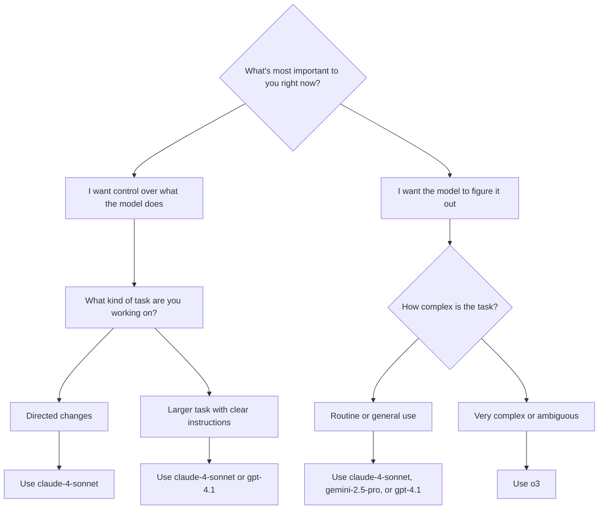
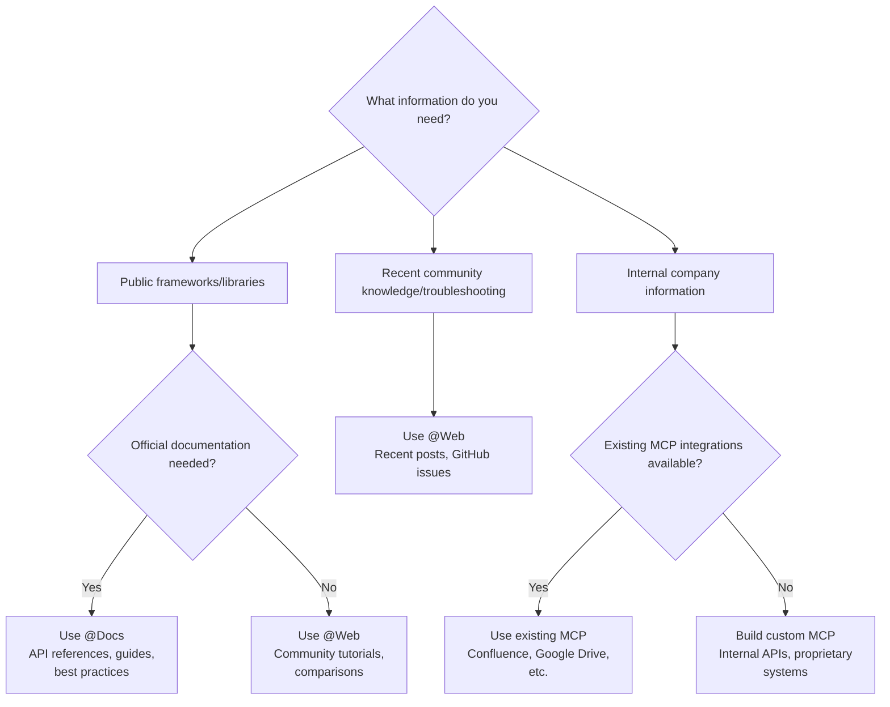

# 🎯 Cursor Playbook

> **The Guide to AI-Powered Development with Cursor**

---

## 🚀 Get Started

### ✨ Key Features
- 🤖 AI-powered code completion and generation with Tab
- 💬 Chat with AI about your code
- ✏️ Edit code using natural language commands
- 📖 Explain code functionality
- 🐛 Fix bugs and optimize code
- 📝 Generate documentation
- 🔄 Convert between programming languages

> [!TIP]
> ### Free/Free-trial Alternative
> While Cursor excels at AI-powered code editing, several alternatives offer unique approaches to AI-assisted development. This section compares the most popular cloud-based solutions with generous free tiers.
> 
> | Tool | Type | Free Plan | AI Models | Best For | Unique Features |
> |------|------|-----------|-----------|----------|-----------------|
> | **Cursor** | IDE | Limited | Claude, GPT-4, Gemini | Code editing & chat | Advanced codebase context |
> | **Github Copilot** | IDE | Limited/Free Trial | Claude, GPT-4, Gemini | Code editing & chat | Advanced codebase context |
> | **Windsurf** | IDE | Generous | Multiple models | Full development | Full IDE like Cursur but offer Tab and agent mode using SWE-1 Lite model (in-house model of Windsurf) unlimited to free-users |
> | **Kiro** | IDE | Free during preview | Multiple models | Full development | Spec-driven development: Transforms vibe coding into structured engineering with requirements, design docs, and task lists |
> | **Gemini CLI** | Command line | Free (quota) | Gemini Pro | Terminal tasks | Tips: Use Google AI Studio API (free account) for more credits than Gemini API |
> | **Replit** | Cloud IDE | Generous | Multiple models | Web development | Instant deployment |
> | **Lovable** | Web Builder | Free tier | GPT-4, Claude | App creation | Visual development |
> | **V0** | Web tool | Free credits | GPT-4 | UI generation | Component-focused. Especially suitable if using NextJs and shadcn |
> | **Gemini Code Assist - Code Review** | Github-based Code Reviewer | Free | | Review fresher/junior code without understanding 'bout business requirements out of the PR | Can automatically review code on Github, allows custom instructions, can summarize PR and review code similar to a senior reviewer but does not understand project operations|
> | **Github Copilot - Code Review** | Github-based Code Reviewer | Included in Github Copilot license | | Review fresher/junior code without understanding 'bout business requirements out of the PR | Can automatically review code on Github, allows custom instructions, can summarize PR and review code similar to a senior reviewer but does not understand project operations|

### 🔧 Recommended MCP
- [Context7](https://context7.com/)
- [Figma Dev Mode MCP Server](https://help.figma.com/hc/en-us/articles/32132100833559-Guide-to-the-Dev-Mode-MCP-Server)
- [Browser Tools](https://browsertools.agentdesk.ai/installation)
- [Code Reasoning](https://github.com/mettamatt/code-reasoning)
- [Serena MCP](https://github.com/oraios/serena)

### 📚 Essential Sources
- [Cursor 101](https://cursor101.com/)
- [dotCursorRules](https://www.dotcursorrules.dev/)
- [Playbooks](https://playbooks.com/)

> [!TIP]
>
> ### IMPORTANT: The 15-Minute Rule
> 
> If a task takes more than 15 minutes, it’s too big. Here’s how to break it down:
> 
> **Wrong:**
> ```
> ❌ "Build user authentication"
> ```
>
> **Right way:**
> ```
> ✅ Better:  
> - Create login form component  
> - Add email validation  
> - Set up password hashing  
> - Create JWT token endpoint  
> - Add login button to navbar  
> - Write login success test
> ```
>
> 
> | Task Size | Time | AI Success Rate | Example |
> |-----------|------|-----------------|---------|
> | Micro | 5 min | 95% | Add loading spinner |
> | Small | 15 min | 85% | Create user profile component |
> | Medium | 45 min | 60% | Implement search feature |
> | Large | 2+ hours | 20% | Build entire dashboard |


---

## 📋 Table of Contents

- [🚀 Get Started](#-get-started)
- [📚 I. Basic User Guide](#-i-basic-user-guide)
  - [⌨️ Essential Keyboard Shortcuts](#️-essential-keyboard-shortcuts)
  - [💡 Tips](#-tips)
  - [📝 Basic Editor Features](#-basic-editor-features)
- [🤖 II. AI Features & Common Use-Cases](#-ii-ai-features--common-use-cases)
  - [🎯 AI Features](#-ai-features)
  - [⚡ AI-Powered Development](#-ai-powered-development)
- [🔬 III. Advanced Topics](#-iii-advanced-topics)
  - [🏗️ Workspace Context](#️-workspace-context)
  - [👥 Pair Programming with AI](#-pair-programming-with-ai)
  - [🎛️ AI Model Selection](#️-ai-model-selection)
  - [🌐 Web Development](#-web-development)
  - [📖 Reading Documents](#-reading-documents)
  - [🏢 Large Codebases](#-large-codebases)
- [🎨 IV. Project-Specific AI Usage](#-iv-project-specific-ai-usage)
  - [⚛️ AI for Frontend Development](#️-ai-for-frontend-development)
  - [🗄️ AI for Backend Development](#️-ai-for-backend-development)
  - [🌍 AI for Full-Stack Development](#-ai-for-full-stack-development)

---

## 📚 I. Basic User Guide

### ⌨️ Essential Keyboard Shortcuts

> **💡 The most important shortcuts to master**

#### 🤖 Cursor Tab (AI Code Completion)
```
✅ Accept Suggestion           Tab
❌ Reject Suggestion           Esc
➡️ Partial Accept              Ctrl/⌘ + →
```

#### 🛠️ Cmd K (Inline Editing)
```
🔧 Open Cmd K                  Ctrl/⌘ + K
✅ Apply Changes               Ctrl/⌘ + ↵
❌ Cancel/Delete Changes       Ctrl/⌘ + ⌫
```

#### 💬 Chat Interface
```
💬 Open Chat                   Ctrl/⌘ + L
➕ Add Code to Chat            Ctrl/⌘ + L
```

#### 🎼 Composer
```
🎼 Open Composer               Ctrl/⌘ + I
🖥️ Open Full-screen Composer   Ctrl/⌘ + Shift + I
```

#### 🔗 @ Symbols
```
📄 Reference File              @filename
⚡ Reference Function          @functionName
🔧 Reference Variable          @variableName
🔍 Search Codebase             @codebase query
🌐 Search Web                  @web query
```

#### 🎛️ General
```
🎯 Open Command Palette        Ctrl/⌘ + Shift + P
⚙️ Open Settings               Ctrl/⌘ + ,
📂 Toggle Sidebar              Ctrl/⌘ + B
📄 New File                    Ctrl/⌘ + N
💾 Save File                   Ctrl/⌘ + S
🖥️ Toggle Terminal             Ctrl/⌘ + `
```

### 💡 Tips

> **🎯 Essential tips to work effectively with AI coding**

### 🏗️ Setup & Configuration

#### 1. 📋 Start Like a Project Manager, Not a Prompt Monkey
- ✍️ Write a real PRD before anything else
- 📝 Describe what you're building, why, and what tools you're using
- 📁 Keep it in your root directory as `product.md` or `instructions.md`
- 🔄 Reference this often — AI context evaporates quickly

#### 2. 🧹 Clean Your House Weekly
- 🗑️ Delete temp files and dead code
- 📁 Reorganize folders
- ✨ Clean codebases make better prompts

#### 3. 📐 Evolve .cursorrules Through Experience
- 🌱 **Start small** — don't overthink the initial rules file
- 🔄 **When Cursor gets it right after your intervention**: Ask it to author/update a rule with its learnings
- ❌ **Two-mistake rule**: Add to `.cursorrules` whenever Cursor repeats the same mistake twice
- 🎯 **Optional boost**: Reference [cursor.directory/rules](https://cursor.directory/rules) for framework-specific templates
- 🎓 **Result**: Organic evolution from toddler to disciplined intern based on your actual workflow

### 🧠 Workflow Architecture

#### 4. 🗺️ Don't Touch Anything Until You've Scoped the Feature
- 🎯 Use GPT/Claude to map the full feature first
- 🔍 Choose a single approach before coding
- ⚡ Cursor is for execution, not ideation

#### 5. 🧩 Prompt in Layers for Maximum Clarity
- 📋 Use GPT to plan architecture
- 🔍 Use Claude to critique approach
- ⚡ Use Cursor to execute code
- 💡 Use parallel sessions for better thinking

#### 6. 🐛 Master the Debug Strategy
- ❓ **First**: Ask AI to investigate — "What broke? Why?" (demand reasoning)
- 📋 **Before fixing**: Request 3 potential solutions, choose one approach
- 🔧 **Then**: Execute the fix systematically  
- 📝 **Finally**: Document the solution in your rules

#### 7. 🔗 Reference Existing Code Patterns
- ❌ **Don't**: "Make a dropdown menu"
- ✅ **Do**: "Make a dropdown similar to @components/Select.tsx"
- 🎯 AI performs significantly better with concrete code context
- 🔍 Cursor can see and learn from your existing patterns

### ⚡ Execution Discipline

#### 8. 🧩 Practice Task Sizing Discipline
- ✂️ Split work into 1-3 message blocks (micro prompts)
- ⏰ **15-Minute Rule**: If task takes >15 minutes, it's too big
- 🚫 Don't ask Cursor to build entire applications
- 🎯 Use AI for stubs, logic chunks, controlled refactors
- 📈 Remember: Task size correlates directly with AI failure rate

#### 9. 💬 Short Chats > Smart Chats
- 🚫 Don't hoard 400-message threads
- 🆕 Start new chat per issue
- 🎯 Keep scope tight with clear commands

#### 10. ⚡ Tech Debt Builds at AI Speed
- 🚀 AI helps you MVP fast, but also digs mess faster
- ⏸️ Pause regularly to refactor and maintain architecture
- 📋 Use git checkpoints every hour for safety
- 🏗️ Keep structural integrity as your priority

### 📝 Basic Editor Features

> **🔧 Core editor functionality**

#### 📁 Opening Files and Projects
```
📂 File > Open Folder
📝 File > Open Recent
📄 Ctrl+O (macOS: Cmd+O) to open files
```

#### 🧭 Editor Navigation
```
📍 Ctrl+G (macOS: Cmd+G): Go to line
🔍 Ctrl+P (macOS: Cmd+P): Quick open file
🎯 Ctrl+Shift+O (macOS: Cmd+Shift+O): Go to symbol
🔄 Ctrl+Tab: Navigate between open files
```

#### 🖱️ Multiple Cursors
```
➕ Alt+Click (macOS: Option+Click): Add cursor
⬆️⬇️ Ctrl+Alt+Up/Down (macOS: Cmd+Option+Up/Down): Add cursor above/below
🔄 Ctrl+D (macOS: Cmd+D): Select next occurrence of selection
```

#### 🎯 Selections
```
📋 Ctrl+L (macOS: Cmd+L): Select current line
↔️ Shift+Alt+Right/Left (macOS: Shift+Option+Right/Left): Expand/shrink selection
📝 Ctrl+Shift+L (macOS: Cmd+Shift+L): Select all occurrences of current selection
```

#### ✏️ Editing
```
⬆️⬇️ Alt+Up/Down (macOS: Option+Up/Down): Move line up/down
📋 Shift+Alt+Up/Down (macOS: Shift+Option+Up/Down): Copy line up/down
💬 Ctrl+/ (macOS: Cmd+/): Toggle comment
💡 Ctrl+Space: Trigger suggestion
```

---

## 🤖 II. AI Features & Common Use-Cases

### 🎯 AI Features

#### ⌨️ AI Keyboard Commands
> **Keyboard shortcuts for AI interactions**

```
🤖 Main AI Shortcuts
💬 Ctrl+K (macOS: Cmd+K): Chat with AI
⚡ Ctrl+L (macOS: Cmd+L): Generate code or continue writing
✏️ Ctrl+J (macOS: Cmd+J): Edit code with AI
📖 Ctrl+I (macOS: Cmd+I): Explain selected code
💭 Ctrl+; (macOS: Cmd+;): Inline chat with AI

🎯 AI Commands via Command Palette (F1)
- AI: Chat with AI
- AI: Edit with AI
- AI: Explain Code
- AI: Fix Problem
- AI: Generate Tests
- AI: Generate Documentation
- AI: Convert Code to (language)
- AI: Optimize Code
```

#### 💬 Chat with AI
> **Effective ways to interact with AI assistant**

**📝 Basic Chat Prompts**
```
"How can I optimize this code?"
"Explain what this function does"
"How do I fix this error?"
"What's the best way to implement X?"
"Can you suggest a better approach for this?"
```

**🔧 Code Generation Prompts**
```
"Generate a React component for a login form"
"Write a function to parse CSV data"
"Create an API endpoint for user authentication using Express"
"Write a unit test for this function"
"Implement a binary search tree in Python"
```

**✏️ Code Editing Prompts**
```
"Refactor this code to use async/await instead of promises"
"Convert this class component to a functional component with hooks"
"Optimize this SQL query for better performance"
"Add error handling to this function"
"Update this code to use TypeScript"
```

**💡 Prompt Tips**
- 🎯 Be specific about languages and frameworks
- 📝 Include context about your project
- 🔍 Ask for specific patterns or approaches
- 📚 Provide examples when possible
- 🧩 For complex tasks, break into smaller steps

#### ✏️ AI Code Editing
> **Using AI to modify existing code**

**🔄 Edit with AI Steps**
1. 🖱️ Select the code you want to modify
2. ⌨️ Press Ctrl+J (macOS: Cmd+J) or use command palette
3. 💬 Describe your changes in natural language
4. 👀 Review the AI's suggested changes
5. ✅ Accept or reject the changes

**📝 Example Edit Prompts**
```
"Add TypeScript type definitions to this function"
"Replace the for loop with map() and filter()"
"Add input validation with helpful error messages"
"Update this to handle asynchronous operations"
"Fix the potential memory leak in this component"
"Improve the naming of variables for better readability"
"Add proper error handling for this try/catch block"
"Update this React component to use context instead of props"
```

**📁 Multi-file Edits**
- 📝 Describe changes spanning multiple files
- 📍 Reference file paths explicitly
- 🔗 Explain relationships between files being modified
- 🤖 AI will generate all necessary changes

### ⚡ AI-Powered Development

> **🎯 Common use-cases with AI**

#### 📖 Code Explanation
> **Getting AI explanations for code**

**🔄 Using Code Explanation**
1. 🖱️ Select the code you want explained
2. ⌨️ Press Ctrl+I (macOS: Cmd+I) or use command palette
3. 👀 Review the explanation in the chat panel

**🎨 Customizing Explanations**
```
"Explain this code for a beginner"
"Explain this algorithm in detail"
"Explain what this regex pattern matches"
"Explain the security implications of this code"
"Explain how this code could be optimized"
"Explain this database query's performance characteristics"
```

**🧠 Understanding Complex Code**
- ❓ Ask about specific parts you don't understand
- 📋 Request step-by-step explanation of complex algorithms
- 📚 Ask for examples of how functions might be called
- 📊 Request diagrams or visualizations of data flow
- ⚠️ Ask for potential edge cases or bugs

#### 🔧 Code Generation
> **Creating new code with AI assistance**

**📄 Generating Complete Files**
```
"Generate a React component for a dashboard"
"Create a RESTful API using Express for a blog"
"Write a Python script to process CSV files"
```

**🧩 Generating Specific Code Patterns**
```
"Write a custom React hook for form validation"
"Create a middleware for JWT authentication"
"Generate a Redux slice for user authentication"
"Write a database migration script"
```

**🔄 Step-by-step Generation**
1. 📝 Describe overall functionality
2. 👀 Review AI-generated code
3. 🔧 Ask for adjustments or improvements
4. ➕ Request additional features
5. 📖 Ask for explanations of complex parts
6. 🧪 Request tests or documentation

**⚠️ Testing Generated Code**
- 👀 Always review generated code before using
- 🧪 Test edge cases explicitly
- 🔒 Check for security issues
- ✅ Validate with linters and type checking
- ⚡ Consider performance implications

#### 🐛 Debugging with AI
> **Using AI to solve coding problems**

**🔄 Debugging Steps**
1. 🖱️ Select code with the error or issue
2. 🛠️ Use "AI: Fix Problem" command
3. 📝 Provide error messages or expected behavior
4. 👀 Review AI's analysis and suggested fix
5. ✅ Implement the solution

**🐛 Debugging Prompts**
```
"Fix this TypeError in my React component"
"Why is this infinite loop occurring?"
"Debug this async function that isn't resolving"
"Why is my state not updating in this component?"
"Identify race conditions in this code"
```

**⚡ Optimization Requests**
```
"Optimize this function for better performance"
"Reduce the memory usage of this algorithm"
"Improve the time complexity of this sorting function"
"Refactor this code to be more maintainable"
"Make this API call more resilient to failures"
```

**🔒 Security Auditing**
```
"Check this code for security vulnerabilities"
"Identify potential SQL injection points"
"Review this authentication logic for flaws"
"Make sure this input is properly sanitized"
"Check for potential XSS vulnerabilities"
```

#### 📝 AI for Documentation
> **Generating documentation with AI**

**📋 Documentation Types**
- 💬 Code comments
- 📖 JSDoc/DocStrings
- 📄 README files
- 🌐 API documentation
- 📚 User guides
- 🏗️ Architecture documentation

**📝 Documentation Prompts**
```
"Add JSDoc comments to this function"
"Generate a README for this project"
"Document the API endpoints in this file"
"Create usage examples for this library"
"Add type documentation to these interfaces"
```

**📊 Create documents from codebase**
```
"Generate API documentation for this Express router, including all endpoints, parameters, and response formats"
"Add comprehensive JSDoc comments to this class, documenting all methods and their parameters"
"Create a README for this project that includes setup instructions, usage examples, and API overview"
```

**💬 Create documents from chat sessions**
```
"Summarize our conversation about setting up authentication into a step-by-step guide for the team wiki"
"Create documentation explaining why we chose this database design, including the trade-offs we discussed"
"Write a troubleshooting guide based on this bug we just fixed, including symptoms and resolution steps"
```

**📚 Example: JSDoc Generation**
```javascript
// Before
function calculateTotal(items, discount, tax) {
  const subtotal = items.reduce((sum, item) => sum + item.price * item.quantity, 0);
  const discountAmount = subtotal * discount;
  const taxAmount = (subtotal - discountAmount) * tax;
  return subtotal - discountAmount + taxAmount;
}

// After AI documentation
/**
 * Calculates the total price including discount and tax.
 * 
 * @param {Array<{price: number, quantity: number}>} items - Array of items with price and quantity.
 * @param {number} discount - Discount rate as a decimal (e.g., 0.1 for 10% discount).
 * @param {number} tax - Tax rate as a decimal (e.g., 0.07 for 7% tax).
 * @returns {number} The final total after applying discount and tax.
 */
function calculateTotal(items, discount, tax) {
  const subtotal = items.reduce((sum, item) => sum + item.price * item.quantity, 0);
  const discountAmount = subtotal * discount;
  const taxAmount = (subtotal - discountAmount) * tax;
  return subtotal - discountAmount + taxAmount;
}
```

---

## 🔬 III. Advanced Topics

### 🏗️ Workspace Context

> **🤖 Helping AI understand your codebase**

| Symbol | Example | Use case | Drawback |
|--------|---------|----------|----------|
| `@code` | `@LRUCachedFunction` | You know which function, constant or symbol is relevant to the output you're generating | Requires a lot of knowledge of codebase |
| `@file` | `cache.ts` | You know which file should be read or edited, but not exactly where in the file | Might include a lot of irrelevant context for the task at hand depending on file size |
| `@folder` | `utils/` | Everything or majority of files in a folder is relevant | Might include a lot of irrelevant context for the task at hand |

**🔧 Improving AI Context**
- 📂 Open related files before asking questions
- 🔗 Reference specific files or components
- 📝 Explain project structure when needed
- 🔍 Use workspace-wide searches before asking questions
- 📋 Show AI relevant error messages or logs

**🚫 Managing .cursorignore**
- 📄 Create a `.cursorignore` file to exclude directories
- 📋 Format similar to `.gitignore`
- 🚫 Exclude node_modules, build artifacts, etc.
- 🔒 Exclude sensitive files or directories

```gitignore
node_modules/
dist/
.env
*.log
```

**💡 Tips**
- ➕ Add Code to Chat `Ctrl/⌘ + L`
- 📄 Reference File `@filename`
- ⚡ Reference Function `@functionName`
- 🔧 Reference Variable `@variableName`
- 🔍 Search Codebase `@codebase query`
- 🌐 Search Web `@web query`
- 🛠️ Using MCP or Cursor Rules

**📝 Opening Context for AI**
```
"I'm working on a React project with Redux"
"This is part of an Express API with MongoDB"
"This component is used in our authentication flow"
"We're using Next.js with TypeScript"
"This function is called from multiple places in the app"
```

### 👥 Pair Programming with AI

> **🤝 Effective strategies for coding with AI**

**💪 Effective Collaboration**
- 🧩 Break down complex tasks
- ❓ Ask AI to explain its approach
- 🏗️ Use AI for boilerplate code
- 🔍 Leverage AI for research and comparisons
- 🧪 Let AI generate tests for your code
- 👀 Review and refine AI suggestions

**🔄 Iterative Development**
1. 📝 Describe feature requirements
2. 🤖 Let AI generate initial implementation
3. 👀 Review and identify issues
4. 🔧 Ask for specific improvements
5. 🧪 Test and validate
6. ⚡ Request optimizations or refactoring

**📚 Learning with AI**
- ❓ Ask for explanations of complex code
- 🔄 Request alternative approaches
- 💭 Ask "Why did you choose this pattern?"
- 📊 Request comparisons between different methods
- ⚡ Have AI explain performance implications

### 🎛️ AI Model Selection

> **🎯 Choosing the right AI model for different tasks**



**🎨 Prompting style**
- 🎛️ Be in control, give clear instructions: `claude-4-sonnet`, `gpt-4.1`
- 🚀 Let the model take initiative: `claude-4-opus`, `gemini-2.5-pro`, `o3`

**🎯 Task type**
- 🎯 Directed changes: `claude-4-sonnet`, `gemini-2.5-pro`
- 🔍 Codebase navigation/search: `gemini-2.5-pro`, `claude-4-opus`, `o3`
- 📋 Planning or problem-solving: `claude-4-opus`, `gemini-2.5-pro`
- 🧠 Complex bugs or deep reasoning: `o3`

### 🌐 Web Development

> **🛠️ How to set up Cursor for web development**

https://github.com/user-attachments/assets/81a529e6-8e08-4a0f-870e-defad98d6db6


#### 🎨 Bring in your Figma designs
Designs and mockups are core to web development. Using the official MCP server for Figma, you can directly access and work with design files in Cursor. To get started, follow the set up instructions at:
[Figma Dev Mode MCP Server Guide](https://help.figma.com/hc/en-us/articles/32132100833559-Guide-to-the-Dev-Mode-MCP-Server)

The server exposes multiple tools you can use in your prompts. E.g try to ask for the designs of the current selection in Figma.


#### 🏗️ Keep your code scaffolding consistent
You probably have existing code, a design system, or established conventions you want to reuse. When working with models, it's helpful to reference patterns already in your codebase, such as dropdown menus or other common components.

Working in a large web-based codebase ourselves, we've found that declarative code works especially well, particularly for React and JSX.

If you have a design system, you can help the agent discover it by providing a rule for it. Here's a `ui-components.mdc` file where we try to enforce reuse of components when possible:

```markdown
---
description: Implementing designs and building UI
---
- reuse existing UI components from `/src/components/ui`. these are the primitives we can build with
- create new components by orchestrating ui components if you can't find any existing that solves the problem
- ask the human how they want to proceed when there are missing components and designs
```

As your component library grows, add new rules accordingly. When the rules become too numerous, consider splitting them into more specific categories, such as "only apply when working with user inputs."


#### 🌐 Give Cursor access to browser

To extend Cursor's capabilities, you can set up the browser tools MCP server, which provides access to console logs and network requests. Once configured, you can verify your changes by monitoring console output and network activity. This set up helps ensure your implementation matches your intention. Follow the instructions here to set up the MCP server: [Browser Tools Installation](https://browsertools.agentdesk.ai/installation)


### 📖 Reading Documents

> **📚 How to use documents effectively**



| Tool | Mental Model |
|------|--------------|
| **`@Docs`** | Like browsing and reading official documentation |
| **`@Web`** | Like searching for solutions on the internet |
| **MCP** | Like accessing your internal documentation |

**📝 Example Queries**
```
"@Docs Next.js How do I set up dynamic routing with catch-all routes?"
"@Web latest performance optimizations for React 19"
```

### 🏢 Large Codebases

> **🏗️ How to work with large codebases in Cursor**


https://github.com/user-attachments/assets/6ac227e5-a11b-44ac-9d8f-c8f252bb923a


#### 💬 Use Chat to quickly get up to speed on unfamiliar code
Navigating a large codebase, especially if it's new to you, can be challenging. You often grep, search, and click around to find the specific parts of the codebase you're looking for. With Chat, you can start asking questions to find what you're looking for and get a detailed explanation of how it works.

To give Cursor a heightened understanding of your codebase's structure, be sure to enable **Include Project Structure** from **Settings** for improved performance.


#### 📋 Write rules for domain-specific knowledge
If you were onboarding a new collaborator into your codebase, what context would you give them to make sure they can start doing meaningful contributions?

Your answer to this question is likely valuable information for Cursor to understand as well. For every organization or project, there's latent knowledge that might not be fully captured in your documentation. Using rules effectively is the single best way to ensure Cursor is getting the full picture.

For example, if you're writing instructions for how to implement a new feature or service, consider writing a short rule to document it for posterity.

```markdown
---
description: Add a new VSCode frontend service
---

1. **Interface Definition:**
   - Define a new service interface using `createDecorator` and ensure `_serviceBrand` is included to avoid errors.

2. **Service Implementation:**
   - Implement the service in a new TypeScript file, extending `Disposable`, and register it as a singleton with `registerSingleton`.

3. **Service Contribution:**
   - Create a contribution file to import and load the service, and register it in the main entrypoint.

4. **Context Integration:**
   - Update the context to include the new service, allowing access throughout the application.
```

If there are common formatting patterns that you want to make sure Cursor adheres to, consider auto-attaching rules based on glob patterns.

```markdown
---
globs: *.ts
---
- Use bun as package manager. See [package.json](mdc:backend/reddit-eval-tool/package.json) for scripts
- Use kebab-case for file names
- Use camelCase for function and variable names
- Use UPPERCASE_SNAKE_CASE for hardcoded constants
- Prefer `function foo()` over `const foo = () =>`
- Use `Array<T>` instead of `T[]`
- Use named exports over default exports, e.g (`export const variable ...`, `export function `)
```

#### 📋 Stay close to the plan-creation process
For larger changes, spending an above-average amount of thought to create a precise, well-scoped plan can significantly improve Cursor's output.

If you find that you're not getting the result you want after a few different variations of the same prompt, consider zooming out and creating a more detailed plan from scratch, as if you were creating a PRD for a coworker. Oftentimes **the hard part is figuring out what** change should be made, a task suited well for humans. With the right instructions, we can delegate some parts of the implementation to Cursor.

One way to use AI to augment the plan-creation process is to use Ask mode. To create a plan, turn on Ask mode in Cursor and dump whatever context you have from your project management systems, internal docs, or loose thoughts. Think about what files and dependencies you have in the codebase that you already know you want to include. This can be a file that includes pieces of code you want to integrate with, or perhaps a whole folder.

Here's an example prompt:
```
- create a plan for how we shoud create a new feature (just like @existingfeature.ts)
- ask me questions (max 3) if anything is unclear
- make sure to search the codebase

@Past Chats (my earlier exploration prompts)

here's some more context from [project management tool]:
[pasted ticket description]
```

We're asking the model to create a plan and gather context by asking the human questions, referencing any earlier exploration prompts and also the ticket descriptions. Using a thinking model like `claude-3.7-sonnet`, `gemini-2.5-pro`, or `o3` is recommended as they can understand the intent of the change and better synthesize a plan.

From this, you can iteratively formulate the plan with the help of Cursor before starting implementation.

#### 🛠️ Pick the right tool for the job
One of the most important skills in using Cursor effectively is choosing the right tool for the job. Think about what you're trying to accomplish and pick the approach that will keep you in flow.

| **Tool** | **Use case** | **Strength** | **Limitation** |
|----------|--------------|--------------|----------------|
| Tab | Quick, manual changes | Full control, fast | Single-file |
| Cmd K | Scoped changes in one file | Focused edits | Single-file |
| Chat | Larger, multi-file changes | Auto-gathers context, deep edits | Slower, context-heavy |

**🎯 Each tool has its sweet spot:**
- 🏃‍♂️ **Tab** is your go-to for quick edits where you want to be in the driver's seat
- 🎯 **Cmd K** shines when you need to make focused changes to a specific section of code
- 💬 **Chat** is perfect for those bigger changes where you need Cursor to understand the broader context

When you're using Chat mode (which can feel a bit slower but is incredibly powerful), help it help you by providing good context. Use **@files** to point to similar code you want to emulate, or **@folder** to give it a better understanding of your project structure. And don't be afraid to break bigger changes into smaller chunks - starting fresh chats helps keep things focused and efficient.

---

## 🎨 IV. Project-Specific AI Usage

### ⚛️ AI for Frontend Development

> **🛠️ Using Cursor AI for frontend tasks**

#### ⚛️ React Component Generation
```
"Create a reusable button component with variants"
"Generate a form component with validation"
"Create a responsive navigation bar component"
"Build a data table component with sorting and filtering"
```

#### 🎨 CSS/Styling Assistance
```
"Convert this CSS to Tailwind classes"
"Create animations for this component"
"Optimize these styles for mobile devices"
"Generate a dark mode version of these styles"
```

#### 🔄 State Management
```
"Refactor this component to use useState and useEffect"
"Convert this Redux code to use Redux Toolkit"
"Implement this feature using React Context"
"Add proper state management to this form"
```

#### 🧪 Frontend Testing
```
"Generate Jest tests for this component"
"Create Cypress E2E tests for this user flow"
"Write React Testing Library tests for this hook"
"Add test coverage for edge cases in this component"
```

### 🗄️ AI for Backend Development

> **🛠️ Using Cursor AI for backend tasks**

#### 🌐 API Development
```
"Create a RESTful CRUD API for users using Express"
"Generate GraphQL resolvers for this schema"
"Implement JWT authentication middleware"
"Create database models and migrations"
```

#### 🗃️ Database Queries
```
"Optimize this SQL query for performance"
"Convert this ORM query to raw SQL"
"Write a MongoDB aggregation pipeline for this data"
"Create indexes for these database operations"
```

#### 🛡️ Server-side Validation
```
"Add input validation for this API endpoint"
"Implement error handling for this service"
"Create a rate limiting middleware"
"Add data sanitization to prevent injection attacks"
```

#### 🧪 Backend Testing
```
"Generate unit tests for this service"
"Create integration tests for this API"
"Write mock tests for external services"
"Generate test fixtures and factory functions"
```

### 🌍 AI for Full-Stack Development

> **🔄 End-to-end development with Cursor AI**

#### 🚀 Project Setup
```
"Create a new Next.js project with TypeScript"
"Set up a MERN stack application structure"
"Configure Webpack for this project"
"Create a CI/CD pipeline configuration"
```

#### 🔐 Authentication Flows
```
"Implement a complete login/registration system"
"Create OAuth integration with Google"
"Build a password reset flow"
"Set up role-based access control"
```

#### 🗃️ Data Modeling
```
"Design database schema for a blog application"
"Create TypeScript interfaces for these API responses"
"Generate database migrations based on these models"
"Implement data validation and sanitization"
```

#### ⚡ Performance Optimization
```
"Find and fix rendering bottlenecks in this component"
"Optimize API response times for this endpoint"
"Implement proper caching for these resources"
"Add lazy loading to this application"
```

---

## 🤝 Contributing

We welcome contributions to improve this playbook! Please feel free to:

1. 🐛 Report issues or bugs
2. 💡 Suggest new features or improvements
3. 📝 Submit pull requests with enhancements
4. 📚 Add more examples and use cases

## ⭐ Show Your Support

If you found this playbook helpful, please consider:

- ⭐ Starring this repository
- 🐦 Sharing it on social media
- 📝 Contributing improvements
- 💬 Providing feedback

---

<div align="center">

**Made by the Cursor community**

[Developer Updates](https://www.developerupdates.com/cheatsheets) • [cursor101 Cheatsheet](https://cursor101.com/cursor/cheat-sheet) • [Vibe Code Lab](https://vibecodelab.co/) • [Cursor – Offical Advanced Guides](https://docs.cursor.com/guides) • [Cem.karaca - Vibe Coding Guide](https://medium.com/@cem.karaca/the-complete-guide-to-vibe-coding-best-practices-for-ai-powered-development-5529dedfd2a7)

</div>
